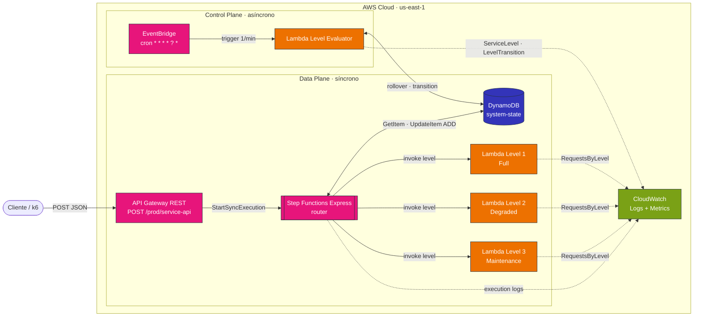

# Diagrama de Componentes

**Convenciones**

- Líneas continuas: invocaciones síncronas en el path del request
- Líneas punteadas: emisión asíncrona de logs/métricas (no bloquea)
- Doble flecha: lectura y escritura

**Lectura del diagrama**

El sistema se organiza en dos planos que comparten un único punto de coordinación: la tabla `system-state` en DynamoDB.

- **Data Plane** atiende requests del cliente. API Gateway delega en una máquina de estados Express que decide a qué nivel enrutar leyendo el estado actual y, si el request reporta error, lo cuenta atómicamente en DynamoDB antes de invocar la Lambda correspondiente.
- **Control Plane** observa y decide. Cada minuto al segundo `:00` UTC, EventBridge dispara al Level Evaluator, que cierra la ventana del minuto anterior y aplica la regla de transición.

CloudWatch recibe logs de ejecución del state machine y métricas custom de los componentes que las emiten.
