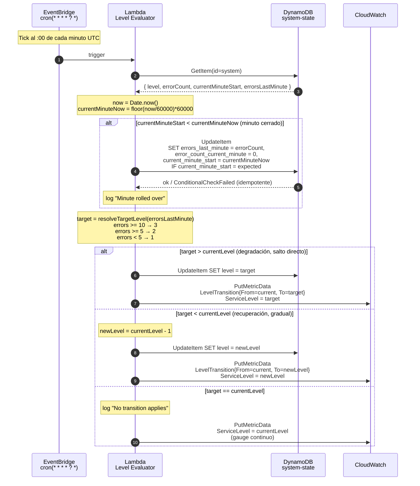

# Diagrama de Secuencia · Control Plane (ciclo de evaluación cada minuto)

**Propiedades clave**

- **Idempotencia del rollover**: la `ConditionExpression` sobre `current_minute_start` previene rollovers duplicados si el evaluador se ejecuta dos veces en el mismo minuto.
- **Atomicidad del estado**: cada cambio de nivel es una operación atómica en DynamoDB.
- **Independencia del path de request**: aunque el evaluador no se ejecute (por ejemplo por un fallo aislado), el data plane sigue sirviendo requests con el último nivel conocido. La pérdida de un tick solo retrasa el cambio, no lo bloquea.
- **Gauge continuo**: la métrica `ServiceLevel` se publica en cada evaluación (haya o no transición), garantizando una serie temporal completa para dashboards.
