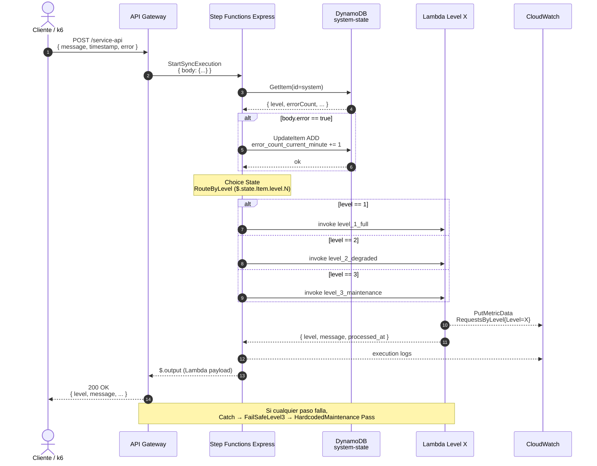

# Diagrama de Secuencia · Data Plane (request síncrono)

**Notas de diseño**

- API Gateway invoca el state machine **síncronamente** vía la integración nativa `states:StartSyncExecution`. No hay Lambda intermedia.
- El conteo de errores ocurre **antes** del routing, garantizando que el request actual ya cuente para la próxima ventana de evaluación.
- `RequestsByLevel` se publica desde la propia Lambda L1/L2/L3 en modo "best-effort" (un fallo en CloudWatch no rompe el request).
- En caso de fallo de cualquier paso, hay tres niveles de defensa: retries con backoff, Catch hacia `FailSafeLevel3` (que reintenta L3), y como último recurso un `Pass` state hardcoded que sintetiza la respuesta de mantenimiento sin invocar Lambda.
