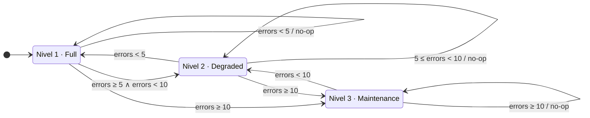

# Diagrama de Estados · Niveles de Servicio



**Reglas de transición**

Las transiciones se evalúan **al cierre de cada minuto** comparando el número de errores observados durante el minuto recién cerrado contra los umbrales:

```
errors >= 10  → target = Nivel 3
errors >= 5   → target = Nivel 2
errors < 5    → target = Nivel 1
```

| Tipo | Comportamiento | Justificación |
|---|---|---|
| **Degradación** | Salto directo al `target` (puede saltar de 1 a 3) | Reaccionar rápido al deterioro de salud |
| **Recuperación** | Un nivel a la vez (solo `currentLevel - 1`) | El reto exige recuperación gradual |
| **Permanencia** | Sin operación | Ahorra escrituras innecesarias |

**Ejemplo de trayectoria**

| Minuto cerrado | Errores | Nivel previo | Nivel siguiente | Tipo |
|---|---|---|---|---|
| 1 | 5 | 1 | 2 | degrade |
| 2 | 0 | 2 | 1 | recover (gradual) |
| 3 | 15 | 1 | 3 | degrade (salto) |
| 4 | 0 | 3 | 2 | recover (gradual) |
| 5 | 15 | 2 | 3 | degrade |
| 6 | 0 | 3 | 2 | recover (gradual) |
| 7 (sin tráfico) | 0 | 2 | 1 | recover (gradual) |
