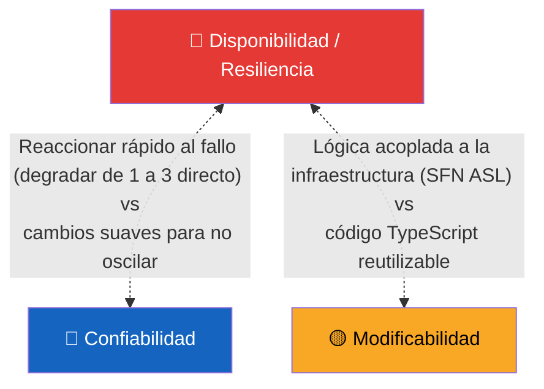
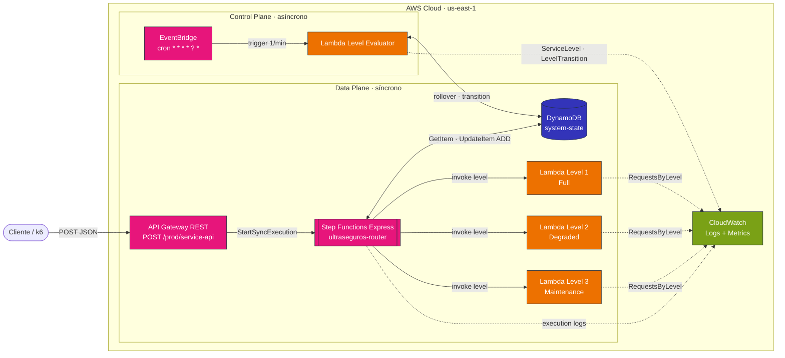
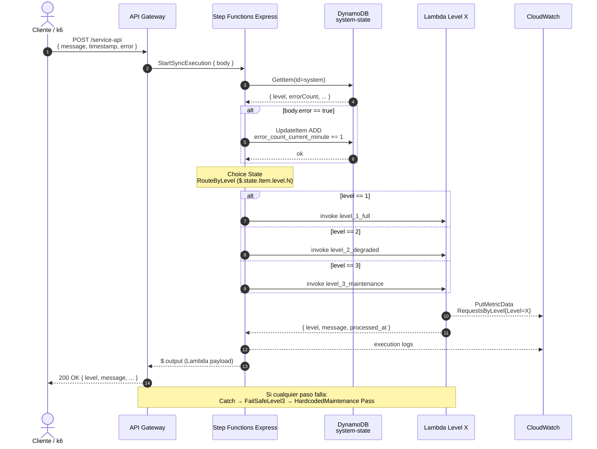
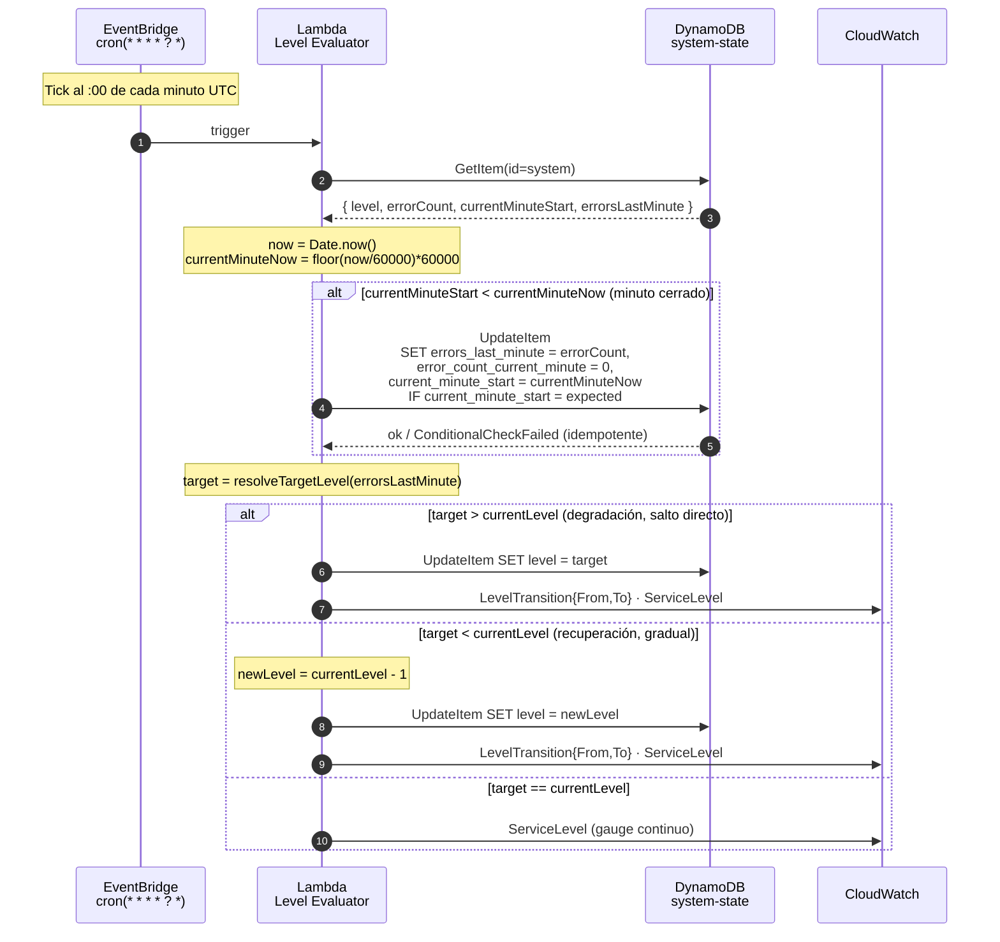
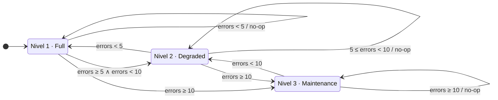

# Documentación Técnica — Arquitectura de Resiliencia · UltraSeguros S.A.

---

## 1. El Reto

**Sistemas UltraSeguros S.A.** opera servicios críticos (transacciones financieras, análisis en tiempo real, monitoreo de infraestructura) que deben **mantenerse operativos incluso en las peores circunstancias**. Durante picos de tráfico el sistema falla, generando pérdidas. Se requiere una arquitectura que detecte fallos automáticamente, **degrade progresivamente** sus capacidades y se **recupere automáticamente** cuando los indicadores vuelvan a la normalidad.

### 1.1 Niveles de servicio

| Nivel | Nombre | Comportamiento |
|---|---|---|
| 1 | Full | Todas las capacidades activas |
| 2 | Degraded | Subconjunto reducido, prioriza servicios esenciales |
| 3 | Maintenance | Responde con mensaje de mantenimiento |

### 1.2 Reglas de transición

**Umbrales (evaluados sobre los errores del minuto recién cerrado):**

| Errores en ventana | Nivel objetivo |
|---|---|
| ≥ 10 | Nivel 3 |
| ≥ 5 y < 10 | Nivel 2 |
| < 5 | Nivel 1 |

**Característica clave:** la **recuperación es gradual** (un nivel a la vez por evaluación), mientras que la degradación puede aplicar saltos para reaccionar rápido al deterioro.

### 1.3 Requisitos arquitectónicamente significativos

| Tipo | Requisito |
|---|---|
| Funcional | Inicia en Nivel 1; transita entre niveles según los umbrales; responde con el mensaje correspondiente al nivel actual |
| Funcional | Procesa el 100% de las requests, incluso bajo degradación |
| No funcional | Memoria de errores en ventana de 1 minuto |
| No funcional | Recuperación gradual (no saltos hacia arriba) |
| Restricción | Solo servicios AWS · API Gateway como entrada · 3 servicios desplegados |
| Restricción | El script de carga k6 no puede modificarse |

---

## 2. Atributos de Calidad

> El diseño de esta arquitectura siguió la metodología **ADD (Attribute-Driven Design)**: los atributos de calidad enunciados a continuación son el motor de las decisiones que se documentan en las secciones 3, 4 y 5. Cada iteración del diseño se justifica por su impacto sobre estos atributos, no por preferencias tecnológicas.

### 2.1 Atributos priorizados

| Atributo | Justificación | Prioridad |
|---|---|---|
| **Disponibilidad / Resiliencia** | El reto lo enuncia explícitamente: el sistema debe seguir respondiendo bajo carga adversa, degradar de forma controlada y recuperarse sin intervención humana | 🔴 Alta |
| **Confiabilidad** | El estado del sistema (nivel actual, contador de errores) debe ser consistente entre múltiples requests concurrentes y entre el plano de datos y el plano de control | 🔴 Alta |

### 2.2 Atributos implícitos

Atributos que el sistema gana como consecuencia de las decisiones tomadas, sin haber sido objetivos primarios:

| Atributo | Cómo se manifiesta |
|---|---|
| **Modificabilidad** | Reglas de transición aisladas en una función pura (`evaluateTransition`), umbrales en un solo punto, módulos Terraform por componente |
| **Observabilidad** | Logs estructurados del state machine y del Level Evaluator; métricas custom `ServiceLevel`, `LevelTransition` y `RequestsByLevel` que permiten reconstruir la trayectoria del sistema. Surgió como necesidad para validar el comportamiento ante el escenario de prueba, no como driver inicial |
| **Seguridad** | IAM con privilegio mínimo, condiciones por namespace en `cloudwatch:PutMetricData`, sin secretos hardcodeados |

### 2.3 Atributos no priorizados

| Atributo | Por qué no es prioritario |
|---|---|
| **Rendimiento (latencia)** | El reto no especifica SLA de latencia. La latencia observada (avg ~350 ms, p95 ~520 ms) es propia del patrón serverless con orquestación y se considera aceptable. Si se priorizara, comprometería la simplicidad del diseño |
| **Costo** | Para una PoC académica el volumen es despreciable. Una optimización agresiva añadiría complejidad sin valor demostrable |

### 2.4 Tensiones entre atributos

### 2.5 Decisiones de priorización

| Decisión | Atributo ganado | Atributo sacrificado | ¿Por qué es aceptable? |
|---|---|---|---|
| Degradación con saltos directos (1→3 si errores ≥10) | **Disponibilidad** (reacción inmediata) | **Confiabilidad** (oscilación posible si los errores fluctúan) | El costo de servir requests con un nivel inadecuado es mayor que el de una transición agresiva; recuperación gradual amortigua oscilaciones |
| Recuperación de un escalón por minuto | **Confiabilidad** (estabilidad) | **Disponibilidad** (un minuto adicional sirviendo en degradado) | El reto exige recuperación gradual; permite verificar estabilidad antes de restaurar funcionalidad completa |
| Estado en una sola fila de DynamoDB | **Confiabilidad** (atomic counters) y **Modificabilidad** (esquema simple) | **Disponibilidad teórica** (ítem único como punto de contención lógico) | DynamoDB regional es multi-AZ; un solo ítem soporta miles de TPS; la simplicidad supera el riesgo |
| Lógica de routing en SFN ASL declarativo | **Disponibilidad** (sin Lambda intermedia que pueda fallar) | **Modificabilidad** (ASL es menos expresivo que código) | Las reglas de routing son estables; los cambios serían poco frecuentes |
| Plano de control desacoplado del plano de datos | **Disponibilidad** (un fallo del evaluador no bloquea requests) | **Latencia de transición** (típicamente 1-5 segundos tras el cierre del minuto) | Mantener requests fluyendo es más crítico que reaccionar en el segundo |

---

## 3. Arquitectura de la Solución

### 3.1 Visión general

El sistema se organiza en **dos planos** que comparten un único punto de coordinación: la tabla `system-state` en DynamoDB.

| Plano | Función | Componentes | Modo |
|---|---|---|---|
| **Data Plane** | Atender el request del cliente con el nivel actual | API Gateway → Step Functions Express → DynamoDB → Lambdas L1/L2/L3 | Síncrono |
| **Control Plane** | Cerrar la ventana del minuto, evaluar transiciones, emitir métricas | EventBridge → Lambda Level Evaluator → DynamoDB → CloudWatch | Asíncrono, periódico |

Esta separación es la decisión arquitectónica más importante del diseño: **un fallo del plano de control no bloquea el plano de datos**, y viceversa.

### 3.2 Diagrama de Componentes

[aws-components](docs/diagrams/components.png)

> Líneas continuas: invocaciones síncronas. Líneas punteadas: emisión asíncrona de logs/métricas.

### 3.3 Diagrama de Secuencia · Plano de Datos

### 3.4 Diagrama de Secuencia · Plano de Control

### 3.5 Diagrama de Estados

| Tipo de transición | Comportamiento | Justificación |
|---|---|---|
| **Degradación** | Salto directo al nivel objetivo (puede saltar de 1 a 3) | Reaccionar rápido al deterioro |
| **Recuperación** | Un nivel a la vez | El reto exige recuperación gradual |
| **Permanencia** | Sin operación | Ahorra escrituras innecesarias |

---

## 4. Tácticas de Arquitectura

> Tácticas según la taxonomía de Bass, Clements y Kazman (*Software Architecture in Practice*, 4.ª edición). Se incluyen también dos patrones complementarios ampliamente reconocidos en arquitecturas serverless.

| Táctica | Atributo | Componente | Decisión |
|---|---|---|---|
| **Monitor** (detect faults) | Disponibilidad | DynamoDB `error_count_current_minute` + Level Evaluator | El evaluador inspecciona el contador al cierre de cada minuto y decide si el sistema está saludable |
| **Graceful Degradation** | Disponibilidad | 3 Lambdas L1/L2/L3 | Cada nivel ofrece una capacidad reducida pero coherente; el sistema nunca deja de responder |
| **Retry** | Disponibilidad | Step Functions Tasks | Backoff exponencial (1-2-4 s, 3 intentos) en operaciones a DynamoDB y Lambda |
| **Exception Handling** | Disponibilidad | `Catch` global + `FailSafeLevel3` + `HardcodedMaintenance` Pass | Cascada de defensa: error → reintento L3 → respuesta canned |
| **State Resynchronization** | Disponibilidad | Rollover idempotente con `ConditionExpression` | Si dos ejecuciones del evaluador coinciden, solo una hace efectivo el rollover |
| **Transactions** | Confiabilidad | DynamoDB `UpdateItem ADD :one` | Conteo atómico de errores ante concurrencia alta |
| **Encapsulate** | Modificabilidad | Función pura `evaluateTransition(level, errors)` | La regla de transición está aislada del resto del sistema y es testeable sin AWS |
| **Bulkhead** *(patrón complementario)* | Disponibilidad | 3 Lambdas independientes | Aislamiento de fallos: cada Lambda tiene su propio deploy, role IAM y log group |
| **Fallback** *(patrón complementario)* | Disponibilidad | `HardcodedMaintenance` Pass state | Respuesta sintética de último recurso cuando ningún componente puede atender el request |

---

## 5. Decisiones de Diseño (ADRs)

### ADR-001: Step Functions Express en lugar de Lambda Router

- **Contexto**: API Gateway necesita decidir a qué Lambda enrutar (L1/L2/L3) según el nivel actual del sistema y, opcionalmente, contar errores en DynamoDB. La primera iteración usaba una Lambda intermedia ("Router") que leía estado, contaba el error e invocaba la Lambda destino.
- **Decisión**: Reemplazar el Router por una **State Machine Step Functions Express** invocada síncronamente desde API Gateway vía `states:StartSyncExecution`. La SFN usa integraciones nativas con DynamoDB (GetItem, UpdateItem) y Lambda (Invoke), sin código intermedio.
- **Alternativa descartada (Lambda Router)**: Mantener el patrón inicial. Eliminada por incurrir en el anti-patrón "Lambda calling Lambda" (doble cold start, doble facturación, doble superficie de fallo).
- **Alternativa descartada (Lambda Function URLs / ALB)**: No permiten orquestación declarativa de múltiples pasos.
- **Trade-off**: ASL es declarativo (JSON), menos expresivo que código TypeScript. El debugging requiere inspeccionar ejecuciones en la consola de Step Functions. Aceptable porque las reglas de routing son estables y simples.

### ADR-002: Plano de control separado vía EventBridge + Lambda Level Evaluator

- **Contexto**: La evaluación de transiciones (degradar/recuperar) podía hacerse en cada request o de forma periódica. Hacerlo en cada request acopla la latencia del path crítico al cálculo de transición y dispersa la lógica.
- **Decisión**: Un componente dedicado, **Lambda Level Evaluator**, disparado cada minuto por EventBridge. Hace el rollover de la ventana de errores y aplica la regla de transición sobre el minuto recién cerrado. Actualiza el nivel en DynamoDB y emite métricas.
- **Alternativa descartada (evaluar en cada request)**: Acoplaba lógica de control con lógica de datos, multiplicaba escrituras a DynamoDB y dificultaba interpretar el estado del sistema en cualquier momento dado.
- **Trade-off**: La latencia entre el cierre de un minuto y la transición depende del tick del scheduler (típicamente 1-5 segundos). Aceptable: el sistema sigue sirviendo requests con el último nivel conocido durante ese intervalo.

### ADR-003: DynamoDB single-row con atomic counters

- **Contexto**: El estado del sistema (nivel actual, contador de errores, ventana de minuto) debe ser consistente entre múltiples requests concurrentes y entre el plano de datos y el plano de control.
- **Decisión**: Una tabla DynamoDB con una **única fila** (`id = "system"`) que contiene todo el estado. Los conteos de error se hacen con `UpdateItem ADD :one` (atómico). El rollover usa `ConditionExpression` para garantizar idempotencia.
- **Alternativa descartada (ElastiCache Redis)**: Aporta menor latencia pero requiere VPC, NAT, mantenimiento de cluster y no es serverless puro.
- **Alternativa descartada (estado en memoria de Lambda)**: Imposible, las instancias de Lambda son efímeras y no comparten memoria.
- **Trade-off**: Una sola fila es un punto de contención lógico; bajo carga muy alta podría haber throttling. Para el caso de uso (≤ ~100 RPS) es ampliamente suficiente. DynamoDB regional es multi-AZ por defecto.

### ADR-004: Memoria de errores en ventana fija de 1 minuto con rollover

- **Contexto**: El reto exige "memoria de 1 minuto" pero no especifica si es una ventana deslizante o fija. Una ventana deslizante requeriría almacenar timestamps individuales o usar bucket por segundo, complicando el modelo.
- **Decisión**: **Ventana fija** alineada con minutos absolutos del reloj UTC (`floor(now/60000) * 60000`). El minuto recién cerrado queda disponible en `errors_last_minute`. El Level Evaluator hace el rollover al inicio del siguiente minuto.
- **Alternativa descartada (ventana deslizante)**: Más precisa, pero significativamente más compleja de implementar en DynamoDB y de razonar sobre.
- **Trade-off**: Un error que ocurre justo antes del cierre del minuto queda en una ventana, uno que ocurre justo después queda en la siguiente. Aceptable porque el comportamiento global (reacción ante ráfagas) es correcto y predecible.

### ADR-005: Degradación con saltos, recuperación gradual

- **Contexto**: El reto define umbrales absolutos (≥5 → N2, ≥10 → N3) pero exige recuperación **gradual**. Una regla simétrica (saltos en ambas direcciones) no cumple el requisito; una regla de un escalón en ambas direcciones impide reaccionar rápido a fallos masivos.
- **Decisión**: Función pura `evaluateTransition(currentLevel, errors)`:
  - Si `target > currentLevel` → ir directo al `target` (degradación con saltos).
  - Si `target < currentLevel` → bajar **un nivel** a la vez (recuperación gradual).
  - Si `target == currentLevel` → no-op.
- **Alternativa descartada (saltos en ambas direcciones)**: Incumple el requisito de recuperación gradual.
- **Alternativa descartada (un escalón en ambas direcciones)**: Una ráfaga de 15 errores en Nivel 1 dejaría al sistema en Nivel 2 sirviendo en degradado a una carga que merece Nivel 3.
- **Trade-off**: La asimetría debe documentarse claramente. Aceptable porque está justificada por el enunciado.

### ADR-006: EventBridge `cron` en lugar de `rate(1 minute)`

- **Contexto**: `rate(1 minute)` ejecuta cada 60s **desde el momento de creación de la regla**, generando un offset arbitrario respecto al reloj. Esto causa que el evaluador no esté sincronizado con el rollover de minuto absoluto que usa el código.
- **Decisión**: Usar `schedule_expression = "cron(* * * * ? *)"`, que dispara al `:00` de cada minuto UTC.
- **Alternativa descartada (rate)**: Con la regla creada a un segundo arbitrario, el evaluador podía intentar evaluar el minuto justo antes de cerrarse, viendo el contador todavía activo y perdiendo la oportunidad de transicionar hasta el siguiente tick.
- **Trade-off**: `cron` y `rate` cuestan lo mismo; sin trade-off económico. La única consideración es que ambos tienen un jitter inherente (~1-5s típico) que no controlamos.

### ADR-007: Fail-safe en cascada (retry → L3 Lambda → Pass state)

- **Contexto**: El sistema debe responder al cliente incluso si DynamoDB o las Lambdas fallan. Un único punto de fallback es frágil.
- **Decisión**: Tres niveles de defensa en el state machine:
  1. **Retry con backoff** en cada Task (3 intentos, 1-2-4 segundos)
  2. **Catch global** que redirige cualquier fallo a `FailSafeLevel3`, una invocación de la Lambda L3
  3. **`HardcodedMaintenance` Pass state** como último recurso, sintetiza la respuesta de mantenimiento sin invocar Lambda
- **Alternativa descartada (un solo Catch a una Lambda)**: Si la Lambda L3 también está caída, el sistema responde con error.
- **Trade-off**: La respuesta del Pass state es estática (no incluye datos del request original). Aceptable: este path solo se activa si el sistema completo está degradado.

### ADR-008: 3 Lambdas independientes (Bulkhead)

- **Contexto**: El reto exige "3 servicios diferentes desplegados". Se podían implementar como 3 paths en una sola Lambda o como 3 Lambdas separadas.
- **Decisión**: Tres Lambdas independientes (`ultraseguros-level-1-full`, `ultraseguros-level-2-degraded`, `ultraseguros-level-3-maintenance`), cada una con su propio código, deploy y log group.
- **Alternativa descartada (una Lambda con switch interno)**: Acopla el código de los tres niveles, un bug en uno puede romper los tres, no hay aislamiento de cold starts ni de cuotas de concurrencia.
- **Trade-off**: Tres deployments en lugar de uno, más superficie operacional. Aceptable porque el aislamiento es la esencia de la táctica `Bulkhead` y porque cumple el requisito explícito del reto.

---

## 6. Riesgos y Consideraciones

> Las severidades reflejan el impacto en el contexto del reto (PoC en una sola región). En una columna aparte se indica cómo cambiaría la severidad en un entorno productivo y la mitigación recomendada.

| # | Riesgo | Severidad (PoC) | Mitigación actual | Mitigación recomendada para producción |
|---|---|---|---|---|
| R1 | Falla de la tabla DynamoDB regional | 🟢 Baja en PoC · 🔴 Alta en producción | Multi-AZ por defecto · `Catch` global → FailSafeLevel3 → Pass | DynamoDB Global Tables para DR multi-región; alarmas sobre `SystemErrors` |
| R2 | Falla del Level Evaluator (no se ejecuta en un tick) | 🟡 Media | Rollover idempotente; el siguiente tick reconstruye correctamente | Alarma CloudWatch sobre invocaciones esperadas vs reales |
| R3 | Cold start de las Lambdas L1/L2/L3 tras inactividad | 🟡 Media | arm64 + runtime ligero; ~50-150 ms adicional al primer request | Provisioned Concurrency en L1 (más usado) |
| R4 | Race condition entre rollover y conteo de errores en el cambio de minuto | 🟢 Baja | Operaciones DynamoDB atómicas; `ConditionExpression` en el rollover | Suficiente para el caso de uso |
| R5 | Umbrales hardcodeados en código TypeScript | 🟡 Media | Aislados en función pura testeable | SSM Parameter Store o ítem de configuración en DynamoDB |
| R6 | Tabla `system-state` sin Point-in-Time Recovery | 🟢 Baja en PoC · 🟡 Media en producción | Decisión consciente para PoC | Habilitar PITR; encryption-at-rest con KMS CMK |
| R7 | Métricas custom desde el path del request agregan ~10-20 ms | 🟢 Baja | Llamadas best-effort; un fallo no rompe el request | Migrar a CloudWatch EMF (logs estructurados) |
| R8 | El reto pide "3 servicios"; se interpreta como 3 Lambdas | 🟢 Baja (interpretativo) | Documentado en ADR-008; cada Lambda es deployment independiente | Si se requieren 3 endpoints HTTP separados, agregar 3 resources en API GW |
| R9 | Latencia de transición desde el cierre del minuto (~1-5 s típico) | 🟢 Baja | `cron(* * * * ? *)` minimiza el offset; rollover idempotente | Reducir granularidad si el caso lo amerita (menor ventana, mayor costo) |
| R10 | Ventana de errores no alineada con minutos del script de carga | 🟡 Media | Ventana fija UTC; comportamiento predecible aunque los conteos por minuto puedan repartirse entre dos ventanas reales | Sincronizar el cliente con el reloj del servidor o usar ventanas deslizantes |

---

## 7. Resultados

### 7.1 Entorno de prueba

| Parámetro | Valor |
|---|---|
| Herramienta de carga | k6 (script provisto, no modificado) |
| Escenario | 1 VU · 140 iteraciones · 3 s entre requests · ~7 minutos |
| Endpoint | `https://gi1231lbni.execute-api.us-east-1.amazonaws.com/prod/service-api` |
| Distribución de errores definida en el script (por minuto del test) | 5 / 0 / 15 / 0 / 15 / 0 |
| Fecha de la corrida documentada | 2026-05-23, 22:08-22:15 UTC |

### 7.2 Métricas k6

| Métrica | Valor |
|---|---|
| Total requests | 140 |
| `http_req_failed` | 0 % (0/140) ✅ |
| `http_req_duration` avg | 351 ms |
| `http_req_duration` median | 347 ms |
| `http_req_duration` p(90) | 464 ms |
| `http_req_duration` p(95) | 524 ms |
| `http_req_duration` max | 937 ms |
| `iteration_duration` avg | 3.35 s (incluye `sleep(3)` del script) |

### 7.3 Trayectoria observada de transiciones

Los datos provienen del log group `/aws/lambda/ultraseguros-level-evaluator`. Cada fila corresponde a un cierre de minuto en el reloj UTC.

| Minuto cerrado (UTC) | Errores observados | Nivel previo → Nuevo | Tipo |
|---|---|---|---|
| 22:07 | 1 | 1 → 1 | sin transición |
| 22:08 | 4 | 1 → 1 | sin transición (justo bajo umbral) |
| 22:09 | 0 | 1 → 1 | sin transición |
| **22:10** | **14** | 1 → **3** | degrade (salto directo) |
| **22:11** | 1 | 3 → **2** | recover (gradual) |
| 22:12 | 9 | 2 → 2 | sin transición |
| 22:13 | 6 | 2 → 2 | sin transición |
| **22:14** | 0 | 2 → **1** | recover (gradual) |
| 22:15 | 0 | 1 → 1 | estable, fin del test |

**Nota sobre los conteos**: el script k6 distribuye los errores en bloques de 20 iteraciones (un "minuto del test"), pero el reloj UTC define la ventana de evaluación. Si el test arranca en un segundo distinto al `:00`, los errores de un mismo bloque del script pueden quedar repartidos entre dos ventanas UTC distintas. Por ejemplo, los 5 errores del primer minuto del script se observaron como 1+4 en las ventanas UTC 22:07 y 22:08; los 15 errores del tercer minuto del script se observaron como 14+1 en 22:10 y 22:11. El comportamiento del sistema sigue siendo correcto: **todas las transiciones aplicadas son consistentes con la regla** y el sistema visita los tres niveles antes de estabilizarse en Nivel 1. Esta dinámica está documentada como riesgo R10.

### 7.4 Validación contra requisitos del reto

| Requisito | Evidencia |
|---|---|
| El sistema atiende todas las requests sin error HTTP | ✅ 140/140 con HTTP 200 (sección 7.2) |
| Inicia en Nivel 1 | ✅ Estado inicial cargado por Terraform; ventana 22:07 confirma N1 |
| Degrada cuando hay errores | ✅ Transición 1→3 a las 22:10 con 14 errores |
| Recupera gradualmente | ✅ Recuperación 3→2 a las 22:11 y 2→1 a las 22:14 (un nivel por minuto) |
| Pasa por los 3 niveles | ✅ N1 (22:07-22:09), N3 (22:10), N2 (22:11-22:13), N1 (22:14-) |
| Vuelve a Nivel 1 al estabilizarse el tráfico | ✅ N1 alcanzado en 22:14 |
| Memoria de 1 minuto | ✅ Ventana fija con rollover idempotente; cada cierre solo considera el minuto recién terminado |
| 3 servicios desplegados | ✅ 3 Lambdas independientes (`ultraseguros-level-1-full`, `-level-2-degraded`, `-level-3-maintenance`) |
| Solo servicios AWS | ✅ Sin dependencias externas |

---

**Versión**: 1.0 — **Fecha**: 2026-05-23
